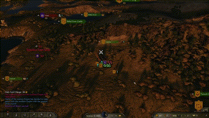
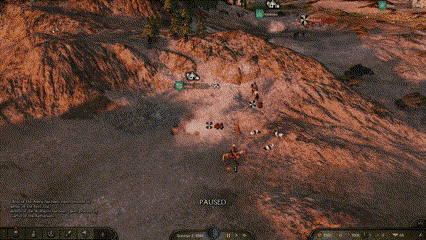

<h1 align="center">Calradian Deserters</h1>
<br>

<p align="center">
        <a href="https://www.nexusmods.com/mountandblade2bannerlord/mods/5829" alt="NexusMods Calradian-Deserters">
    
  </a>
  <a href="https://www.nexusmods.com/mountandblade2bannerlord/mods/5829" alt="NexusMods Calradian-Deserters">
    
  </a>
  <a href="https://www.nexusmods.com/mountandblade2bannerlord/mods/5829" alt="NexusMods Calradian-Deserters">
    
  </a>
  <a href="https://www.nexusmods.com/mountandblade2bannerlord/mods/5829" alt="NexusMods Calradian-Deserters">
    
  </a>
  <a href="https://www.nexusmods.com/mountandblade2bannerlord/mods/5829" alt="NexusMods Calradian-Deserters">
    
  </a>
</p>

<p align="center">
  <a href="https://steamcommunity.com/sharedfiles/filedetails/?id=3021502597"></a>
  <a href="https://steamcommunity.com/sharedfiles/filedetails/?id=3021502597"></a>
  <a href="https://steamcommunity.com/sharedfiles/filedetails/?id=3021502597"></a>
  <a href="https://steamcommunity.com/sharedfiles/filedetails/?id=3021502597"></a>
  <a href="https://steamcommunity.com/sharedfiles/filedetails/?id=3021502597"></a>
</p>

<p align="center">
    <kbd>
        
    </kbd>
</p>


> **Warning**

Please be aware that mods may break your game... So be sure to manually back up your save file, just in case... :ghost:

## Features

- Deserter Parties will be created after battles.
- Deserters will raid villages, attack caravans, villagers and patrol parties.
- There are 6 different deserter factions, one for each culture.
- No second deserter party will be created in close locations in the same week.
- Compatible with [MCM](https://www.nexusmods.com/mountandblade2bannerlord/mods/612).


<p align="center">
    <kbd>
        
    </kbd>
</p>

<p align="center">
    <kbd>
        
    </kbd>
</p>


## How To Install

Find the correct version, download the zip and extract it directly into the following path

```
C:\Program Files (x86)\Steam\steamapps\common\Mount & Blade II Bannerlord\Modules
```


To debug the code or develop it further, do the same as above, and set debug and build paths (if necessary), and run through Visual Studio.